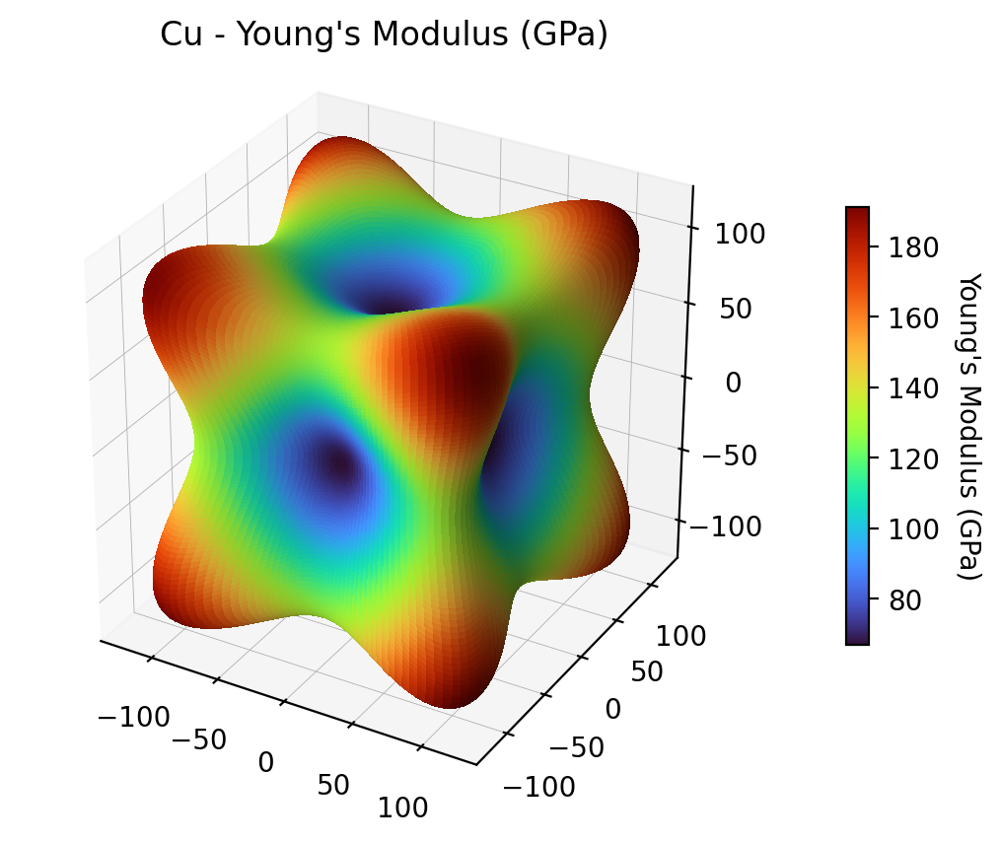

# Stress Tensor Analysis and Material Mechanics

This repository was developped for the WST3 lecture at Kassel University and contains a set of Jupyter notebooks for studying **stress tensors**, **coordinate transformations**, and **anisotropic elastic properties** in solid mechanics.  
Each notebook is designed to be self-contained, combining theoretical explanations with numerical computation and visualization.

## Repository Contents

### 1. `stress_tensor_rotation.ipynb`
**Purpose:**  
Compute and visualize how a 3D **stress tensor** transforms when the **coordinate system** is rotated.

**Features:**
- User-defined stress tensor  
- Applies arbitrary rotations around the x, y, and z axes. 
- Computes the new stress tensor using tensor transformation laws
- Visualizes the original and rotated coordinate axes in 3D

**Key Concepts:**
- Passive coordinate transformations
- Rotation matrices and their order effects 

---

### 2. `find_principal_stresses.ipynb`
**Purpose:**  
Given a general (non-diagonal) stress tensor, find the **principal stresses and principal directions**.

**Features:**
- Uses eigen-decomposition (`np.linalg.eigh`) to find principal stresses  
- Constructs an orthonormal rotation matrix to diagonalize the tensor
- Prints and interprets direction cosines and principal stress values

**Key Concepts:**
- Eigenvalues ↔ principal stresses
- Eigenvectors ↔ principal directions
- Symmetry and degeneracy of stress tensors (handling repeated eigenvalues)

---

### 3. `anisotropic_young_modulus.ipynb`
**Purpose:**  
Compute and visualize the **directional dependence of Young’s modulus** for an **anisotropic material** (e.g., orthotropic or cubic symmetry).

**Features:**
- Defines stiffness/compliance matrices for anisotropic materials
- Calculates the effective Young’s modulus for arbitrary directions
- Visualizes the results using 3D polar plots or surface maps

**Key Concepts:**
- Anisotropy and compliance tensor \( S_{ijkl} \)
- Direction-dependent elastic properties
- Material symmetry and mechanical anisotropy

### Formula

For cubic crystals, the directional Young’s modulus is given by:

1/E(n) = S11 - 2 * (S11 - S12 - 0.5*S44) * (n1^2 n2^2 + n2^2 n3^2 + n3^2 n1^2)

The script evaluates this on a uniform grid over the unit sphere and returns E in GPa provided you are providing S_ij in GPa^-1.

---

### 4. `Standalone Python script anisotropic-young-modulus_cubic-materials_from_compliance_colored.py`

Run the script with your compliances (in GPa^-1):

python anisotropic-young-modulus_cubic-materials_from_compliance_colored.py --S11 0.014928 --S12 -0.006259 --S44 0.013280 --material Cu

| Argument | Type | Required | Description |
|-----------|------|-----------|--------------|
| `--S11` | float | ✓ | Compliance S11 in GPa^-1 |
| `--S12` | float | ✓ | Compliance S12 in GPa^-1 |
| `--S44` | float | ✓ | Compliance S44 in GPa^-1 |
| `--material` | str | ✗ | Material name (used in plot title & filename) |
| `--samples` | int | ✗ | Angular grid resolution (default: 200) |
| `--cmap` | str | ✗ | Colormap name (default: turbo) |

- Output image will be saved as: {material} - Young's Modulus (GPa).png
- Input S_ij in GPa^-1 → Output E in GPa
- Increase `--samples` for smoother surfaces (higher runtime)

---

### 5. `schmid_fcc.ipynb`
**Purpose:**  
Compute the **Schmid factors** for the 12 slip systems in a **face-centered cubic (fcc)** single crystal under uniaxial loading

**Features:**
- User-defined loading direction `[u v w]`  
- Computes Schmid factors for all **{111}⟨110⟩** slip systems  
- Prints a sorted table including φ, λ, cosines, and Schmid factor *m*  
- Produces a 3D visualization of the strongest slip systems

**Key Concepts:**
- FCC slip geometry: 4 {111} planes × 3 in-plane ⟨110⟩ directions = 12 slip systems  
- Schmid’s law: m = cos(φ) · cos(λ)

---

### 6. `schmid_bcc.ipynb`
**Purpose:**  
Compute the **Schmid factors** for the primary 12 slip systems in a **body-centered cubic (bcc)** single crystal under uniaxial loading
(additional high-temperature slip systems are not considered)

**Features:**
- User-defined loading direction `[u v w]`  
- Computes Schmid factors for all **{110}⟨111⟩** slip systems  
- Prints a sorted table including φ, λ, cosines, and Schmid factor *m*  
- Produces a 3D visualization of the strongest slip systems

**Key Concepts:**
- BCC slip geometry: 6 {110} planes × 2 independent ⟨111⟩ directions = 12 systems  
- Schmid’s law: m = cos(φ) · cos(λ)

## Requirements

- Python 3.9+
- NumPy
- Matplotlib 3.7+

## Binder

### Repository overview

### Individual Jupyter Notebooks

 Anisotropic Young's modulus calculation

 Rotate stress tensor

 Find principal stresses from tensor

 Calculate Schmid factors from uniaxially loaded fcc crystal

 Calculate Schmid factors from uniaxially loaded bcc crystal
